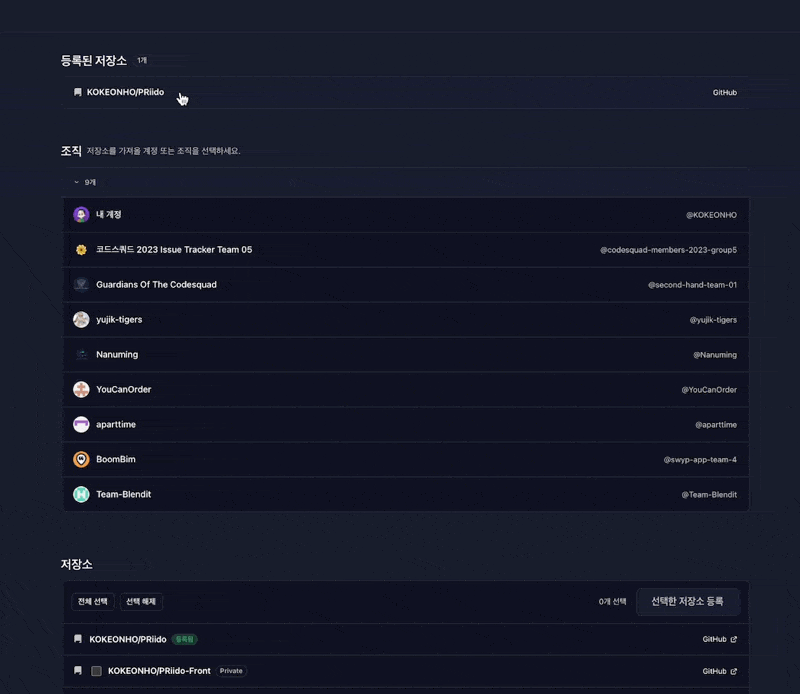
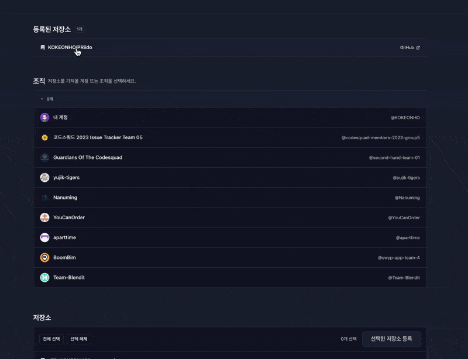
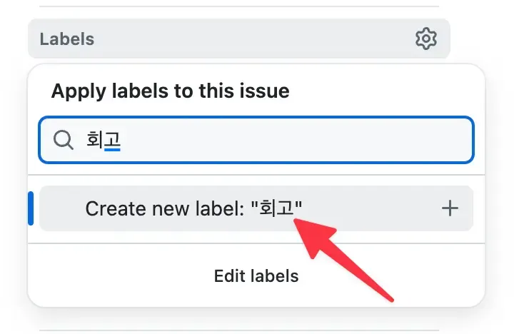

# PRiido

<br>

## 개요

<br>

PRiido는 GitHub PR 정보를 기반으로 비개발자(경영진)가 이해하기 쉬운 개발 보고서를 자동으로 생성하는 서비스입니다.

<br>

## 배경

<br>

매주 여러 저장소에서 병합된 PR을 확인하고 핵심 변경사항을 요약하는 작업은 필요 이상의 시간이 투입됩니다.

또한 PR은 개발자 관점으로 작성되는 경우가 많아, 경영진에게 공유할 때는 추가적인 정리가 필요합니다.

<br>

## 목표

<br>

PRiido는 다음 과정을 자동화합니다.

- GitHub API로 병합된 PR을 수집합니다.
- PR의 제목, 본문, 작성자, 병합 날짜, 변경 파일 수 등의 핵심 정보를 정리합니다.
- Claude API를 통해 비개발자도 이해하기 쉬운 보고서를 생성합니다.
- 보고서는 마크다운 형태로 제공됩니다.

<br>

## 의존성

<br>

- **`@nestjs/config`**

  환경 변수(`.env`) 로드 및 설정 관리를 위한 모듈

<br>

- **`@nestjs/passport`, `passport`**

  NestJS에서 인증 로직을 Guard/Strategy 기반으로 구성하기 위한 라이브러리

<br>

- **`passport-github2`**

  GitHub OAuth 로그인을 구현하기 위한 Passport 전략

<br>

- **`@nestjs/jwt`, `passport-jwt`**

  자체 JWT 발급/검증 및 인증 처리를 위한 라이브러리

<br>

- **`cookie-parser`**

  쿠키 기반으로 토큰을 전달하기 위해 사용

<br>

- **`class-validator`, `class-transformer`**

  요청 DTO 검증 및 입력 데이터 변환을 위해 사용

<br>

- **`@nestjs/typeorm`, `typeorm`, `pg`**

  PostgreSQL 연동 및 데이터 저장을 위한 드라이버와 ORM

<br>

- **`ioredis`**

  Redis 클라이언트

<br>

- **`nanoid`**

  충돌 가능성이 낮은 랜덤 UUID 생성을 위한 라이브러리

<br>

- **`@anthropic-ai/sdk`**

  Claude API 호출을 위한 공식 SDK

<br>

- **`rxjs`**

  NestJS에서 `Observable` 기반 기능(SSE 스트리밍 등)에 사용

<br>

## 실행 방법

<br>

### 1. 배포 환경

<br>

1. **[PRiido](https://priido.cloud) 접속**

   https://priido.cloud

   배포 중인 도메인입니다.

<br>

2. **`GitHub 로그인` 버튼을 클릭하여 로그인**

<br>

3. **메인에 보이는 접근 가능한 조직 중 하나(본인 계정 포함) 선택**

<br>

4. **하단에서 해당 조직(또는 본인 계정)의 저장소를 확인 가능**

<br>

5. **등록할 저장소를 선택(단일, 복수)하고 `선택한 저장소 등록` 버튼을 클릭**

<br>

6. **`등록된 저장소` 섹션에서 특정 저장소를 클릭하여 진입**

   최초 진입 시, PRiido에서 해당 저장소의 PR을 30개씩 병합 시점 내림차순으로 가져옵니다.

   PRiido에 반영되지 않은 신규 PR이 병합됐을 경우, `PR 가져오기` 버튼을 클릭하여 새로 가져올 수 있습니다.

   이미 가져온 PR에서 수정 이력이 발생했을 경우, PR에 개별로 할당된 새로고침 버튼을 클릭하여 stale한 이전 값들을 신규 값들로 업데이트 할 수 있습니다.

<br>

7. **보고서로 작성할 내용의 PR을 선택**

<br>

8. **`보고서 만들기` 클릭하여 보고서 작성**

<br>

### 2. 로컬 환경

<br>

1. **프론트엔드 저장소와 백엔드 저장소 clone**
   - 프론트엔드 저장소: https://github.com/KOKEONHO/PRiido-Front
   - 백엔드 저장소: https://github.com/KOKEONHO/PRiido

<br>

2. **프론트엔드와 백엔드 의존성 설치**

   ```
   # PRiido-Front
   npm install

   # PRiido
   pnpm install
   ```

<br>

3. **GitHub OAuth App 생성 및 설정**

   GitHub OAuth는 본인 계정으로 OAuth App을 생성해서 Cliend ID/Secret을 발급 받아야 합니다.
   보안상 저장소에 제 키를 포함하지 않았습니다.
   - Homepage URL: `http://localhost:5173`
   - Authorization callback URL: `http://localhost:3000/api/auth/github/callback`

<br>

4. **백엔드 프로젝트 루트에 `.env` 생성**

   아래와 같은 `.env` 파일이 필요합니다.

   ```
   PORT=3000
   NODE_ENV=local

   # Dev
   FRONT_ORIGIN=http://localhost:5173

   # DB
   DB_HOST=localhost
   DB_PORT=5432
   DB_USERNAME=postgres
   DB_PASSWORD=postgres
   DB_NAME=priido

   DB_SSL_ENABLED=false

   # Redis
   REDIS_HOST=localhost
   REDIS_PORT=6379
   REDIS_PASSWORD=
   REDIS_DB=0

   # GitHub OAuth (직접 OAuth App 생성 후 입력)
   GITHUB_CLIENT_ID=
   GITHUB_CLIENT_SECRET=
   GITHUB_CALLBACK_URL=http://localhost:3000/api/auth/github/callback

   # JWT
   JWT_SECRET=

   # expires in seconds
   JWT_AT_EXPIRES_SEC=900
   JWT_RT_EXPIRES_SEC=1209600

   # Cookie
   RT_COOKIE_NAME=priido_rt
   COOKIE_SECURE=false
   COOKIE_SAMESITE=lax

   # Claude (직접 발급 후 입력)
   ANTHROPIC_API_KEY=
   CLAUDE_MODEL=claude-opus-4-6
   ```

<br>

5. **PostgreSQL / Redis 실행**
   - PostgreSQL: `5432`
   - Redis: `6379`

<br>

6. **백엔드 서버 실행**

   ```
   # PRiido
   pnpm start:dev
   ```

<br>

7. **프론트엔드 서버 실행**

   ```
   # PRiido-Front
   npm run dev
   ```

<br>

8. **브라우저에서 `http://localhost:5173` 접속 후 동작 확인**

<br>

## 기술 스택

<br>

- **언어**: TypeScript
- **프레임워크**: NestJS
- **데이터베이스**: PostgreSQL, Redis
- **AI**: Claude API
- **Cloud**: AWS
- **CI/CD**: GitHub Actions, Elastic Container Registry, CodeDeploy

<br>

## 기술 스택 선정 이유

<br>

`NestJS`, `TypeScript`, `PostgreSQL`은 스위그 팀에서 실제로 사용하는 백엔드 스택과 일치하기 때문에 선택했습니다.

과제 요구사항을 "구현만 빠르게 끝내는 것"보다, **실제 협업 환경에서 바로 적용 가능한 형태로 문제를 정의하고 설계 근거를 남기는 것**이 더 중요하다고 판단했고, 그래서 스위그의 컨텍스트에 맞춰 진행하는 편이 적합하다고 생각했습니다.

배포는 가장 많이 다뤄본 클라우드 컴퓨팅 서비스인 `AWS`를 채택했습니다.

CI/CD는 백엔드 기준으로 `GitHub Actions`에서 `Docker` 이미지를 구워서 `Elastic Container Registry`에 push한 뒤, `CodeDeploy`로 배포가 진행되도록 구성했습니다.

<br>

## 아키텍처

<br>


PRiido는 AWS VPC 내에서 Nginx + NestJS API 서버를 중심으로 동작하며, 외부로는 GitHub와 Claude API와 연동됩니다.

<br>

- **Nginx**

  프론트 정적 리소스 서빙 및 리버스 프록시 역할을 합니다.

  `/api` 프리픽스가 붙은 요청을 NestJS로 전달합니다.

<br>

- **NestJS**

  핵심 비즈니스 로직을 담당합니다.

  GitHub OAuth 로그인 및 GitHub API 호출을 통해 사용자의 계정, 조직, 저장소, PR을 수집합니다.

<br>

- **Redis**

  현재는 자체 Refresh Token의 저장에 사용되고 있습니다.

<br>

- **PostgreSQL**

  외부에서 직접 접근할 수 없도록 Private Subnet에 두고 NestJS만 접근하도록 구성했습니다.

<br>

## ERD

<br>


<br>

## 기능 정의

<br>

### MVP

<br>

저는 이번 과제의 핵심을 '여러 저장소의 PR 중 보고서에 필요한 PR을 안정적으로 수집하고, 비개발자도 이해 가능한 보고서를 생성, 저장, 조회 가능하게 만드는 것"으로 정의했습니다.

따라서 MVP에서는 **보고서 생성까지의 플로우**를 우선 구현했습니다.

<br>

1. **GitHub OAuth 로그인으로 유저 데이터 확보**

2. **저장소 선택/등록 및 PR 병합된 PR 가져오기**

3. **선택한 PR로 비개발자도 이해하기 쉬운 보고서 생성 및 저장**

4. **보고서 목록 & 상세 조회**

<br>

### 고도화

<br>

MVP를 구현하고 나니 "요구사항을 만족했다"는 것과 "서비스로서 자연스럽게 굴러간다"는 것은 확연히 다르다는 것을 바로 체감했습니다.

과제 요구사항을 그대로 따르면 구현은 깔끔하고 단순했습니다.

하지만 실제 사용자는 PRiido를 사용하고 싶어도 사용할 수 없는 문제가 발생한다는 것을 깨달았고, 그 순간부터 고도화는 이를 개선하기 위한 방향으로 진행됐습니다.

과제를 하면서 재미있었던 점은, 하나를 고치면 다음 문제가 자연스레 튀어나왔다는 것입니다.

그래서 이번 고도화는 "기능 추가"보다는 **문제 해결 → 다른 문제 발생 → 트레이드 오프 비교 → 설계 수정**의 반복이었습니다.

그 흐름을 아래와 같이 정리해봤습니다.

<br>

#### 1. 정적인 기간의 한계

<br>


과제 테스트의 요구사항에는 '지난 주'에 병합된 PR 정보를 수집하라고 나와있습니다.

하지만 서비스 관점에서 정적인 기간만으로는 한계가 명확했습니다.

가령 지난 주에 병합된 PR이 없는 저장소라면, 사용자는 보고서를 만들기 위한 PR을 아예 확보하지 못합니다.

그래서 '지난 주 PR만 수집'이 아니라 **기간에 국한되지 않고 PR을 누적해서 확인하고 선택할 수 있는 형태**가 서비스 목적에 더 부합한다고 판단했습니다.

결과적으로 사용자가 저장소를 등록하면 PRiido는 해당 저장소의 PR을 기간에 상관 없이 가져와서 사용자가 이 중 보고서 생성에 쓸 PR을 선택하도록 했습니다.

<br>

#### 2. 한 번에 가져올 PR 개수

<br>

기간 제한을 없애고 PR을 누적해서 보여주기로 하니, 자연스럽게 "한 번에 몇 개를 보여줄 것인가"를 결정해야 했습니다.

GitHub API는 한 요청에서 가져올 수 있는 PR 개수에 상한(100ㄱ개)이 존재하기 때문에, 결국 **페이지 크기를 어떻게 잡을지**가 핵심이었습니다.

PRiido의 목적은 "전체 PR 탐색"이 아니라 **보고서 생성에 사용할 PR을 고르는 것**이기 때문에, PR을 100개씩 가져오는 것은 낭비입니다.

또한 가져온 100개의 PR 모두가 사용자에게 필요했던 PR일 확률도 낮습니다.

결정적으로, 현재 PR을 가져오는 흐름이 '파일 수정 개수' 같은 필드를 위해서는 PR마다 별도의 API를 또 호출해야하는 구조라 100개의 PR은 서버에 오버헤드가 클 것이라 판단했습니다.

그래서 페이지 크기를 **30개**로 잡았고, **무한 스크롤** 방식으로 구현했습니다.

<br>

#### 3. Pulls API 기반 오프셋 페이지네이션의 한계

<br>

PR을 30개 단위로 끊어서 가져오기로 정한 뒤, 초기 구현은 GitHub Pulls API를 사용했습니다.

Pulls API는 PR 자체를 직접 내려주기 때문에 PR의 메타데이터(본문, 작성자, 상태 등)도 가져올 수 있어 빠르게 MVP를 구성하기에는 적합했습니다.

하지만, 서비스 관점에서 저장소는 "임계 구역"이기 때문에 PR을 가져오는 중에 신규 PR이 추가되거나 아니면 기존 PR이 삭제되는 경우가 발생할 수 있습니다.

Pulls API는 오프셋 페이지네이션이라 이런 변동에 취약하다는 단점이 있습니다.

가령, PR을 가져오는 도중 신규 PR이 추가되면, 기존에 1페이지에 있던 항목이 2페이지로 밀려서 이미 가져온 PR이 다음 페이지에서 다시 가져와지는 현상이 발생할 수 있습니다.

뿐만 아니라 가져온 PR이 저장소에서 삭제되는 경우, 3페이지를 통해서 가져와야할 PR이 당겨져서 2페이지에 위치하게되어 PR이 누락되는 현상도 발생할 수 있습니다.

이 문제를 해결하기 위해 API를 기존 Pulls API에서 Search API로 전환하는 것을 고려했습니다.

두 API는 반환하는 데이터가 다른데, Pulls API는 상기했듯이 PR 리소스를 직접 반환하여 가져온 PR에 대한 정보를 추가적인 API 요청 없이 바로 보여줄 수 있었습니다.

Search API는 검색이 PR 전용이 아니기 때문에 PR 전용 메타데이터가 제한적으로 제공됩니다.

하지만 Search API에서는 PR을 가져올 때 `mergedAt`을 기준으로 범위를 잘라가며 PR을 가져오는 형태로 구현할 수 있기 때문에 누락, 중복을 구조적으로 완화할 수 있다고 판단했습니다.

종합적으로 고려해봤을 때, PRiido 서비스에 더 치명적인 것은 **PR의 누락**이라는 생각이 들었습니다.

PRiido는 특정 기간 동안 병합된 PR을 기반으로 보고서를 생성해주는데, 특정 PR이 누락되면 사용자는 어떤 PR이 누락됐는지를 인지하기 어렵고, 그 결과 보고서에 결함이 생길 수도 있기 때문입니다.

최종적으로 Search API로 리팩터링을 했고, PR 단건에 대해 연관된 커밋과 수정된 파일 데이터를 가져오는 API가 추가로 날아가는 구조가 되었습니다.

<br>

#### 4. 매번 GitHub API를 요청하는 구조의 한계

<br>

Search API로 전환하면서 누락/중복 리스크는 회피할 수 있었지만, 곧바로 **느린 PR 가져오기 속도**가 발목을 잡았습니다.

기존 Pulls API를 사용했을 때는 PR의 메타데이터를 한 번에 받아왔기 때문에 PR 30건을 가져온다고 치면 API 요청도 30회 정도 였습니다.

하지만 Search API로 전환한 뒤에는 PR 단건당 2건(commit, file)이 추가로 날아가기 때문에 서버에서 처리해야하는 API 요청이 급격히 증가했습니다.

서버 부하 뿐만 아니라 사용자에게 PR 목록이 제공되는 시간도 많이 느려졌습니다.

그래서 조회 성능과 서버 부하를 줄이기 위해 설계를 바꿨습니다.

GitHub API는 실시간 조회용이 아닌 **DB 적재용**으로 사용하고, 사용자가 보는 PR 목록 및 PR 상세 정보는 DB를 통해 제공하도록 전환했습니다.

한 번에 보여주는 PR의 개수를 30개로 정했으니 DB에 31개를 먼저 조회하고, 부족한 경우에만 GitHu에 Search API로 가져와서 DB에 채워넣은 뒤 재조회하는 흐름인 것입니다.

이로써 외부 API 호출에 덜 의존적이고, 같은 저장소를 등록한 사용자들끼리 DB의 내용을 공유하여 API 호출이 불필요하게 사용자마다 반복되지 않게 되었습니다.

<br>

#### 5. DB에 적재한 PR의 stale 가능성

<br>

PR을 DB에 적재하는 플로우로 바꾸면서 속도와 서버 부하는 개선됐지만, **stale한 PR**이라는 새로운 문제가 생겼습니다.

DB에 저장된 PR 정보는 어디까지나 **Search API가 날아간 시점의 스냅샷**이기 때문에, 시간이 지나면 저장소의 PR 상태와 달라질 수 있습니다.

가령, 원격 저장소에 새로운 PR이 병합되었는데 PRiido에는 아직 반영되지 않았거나, 이미 적재된 PR의 제목이나 본문이 수정되는 경우가 대표적입니다.

그래서 저는 DB 우선 조회 구조를 유지하되, stale한 PR을 방지하기 위해 동기화 기능을 추가했습니다.

신규 PR을 가져오는 경우에는, 저장소별로 마지막 동기화 기준 시각(`lastSyncedMergedAt`)을 저장해두고 그 이후에 병합된 PR만 Search API로 조회하여 DB에 적재토록 했습니다.

이로써 매번 전체 PR을 다시 가져오지 않고 새로 병합된 PR만 빠르게 반영할 수 있게 됐습니다.

원격 저장소에서 수정 이력이 발생한 PR의 경우에는 사용자가 개별 PR마다 단건으로 새로고침을 할 수 있도록 하는 기능을 추가했습니다.

<br>

#### 6. 답답하고 언제 끝날지 모르는 PR 가져오기

<br>

PR을 DB에 적재하는 구조로 전환하면서 한 번 적재한 PR을 조회하는 속도는 개선됐지만, 사용자가 최초에 저장소에 진입하여 Search API를 통해 PR을 가져와야하는 경우에는 여전히 답답한 문제가 남아있었습니다.

4번 항목에서 간단하게 설명한 것처럼 현재 Search API를 사용한 PR 가져오기는

<br>

1. Search API로 PR 번호 수집
2. PR 단건마다 PR 상세 조회 (`/pulls/{number}`)
3. 연관된 커밋(`/pulls/{number}/commits`)과 파일(`/pulls/{number}/files`)까지 추가로 조회
4. 그 결과를 DB에 저장(upsert)

<br>

이런 플로우로 진행됩니다.

즉, PR 30건을 가져온다고 해도 PR 단건당 여러 API 요청이 묶여 돌아가며 DB 적재까지 수행되기 때문에 사용자 입장에서는 로딩 스피너만 계속 돌고 언제 끝날지 알 수 없는 작업처럼 느껴졌습니다.

PR 가져오기 로직 자체를 수정하기에는 시간이 부족해서 스위그 기술 블로그에서 SSE를 통해 AI로 생성된 작업을 스트리밍 처리하여 건 바이 건으로
화면에 내려주는 방식에 영감을 받아 PRiido에도 해당 방식을 그대로 적용해봤습니다.

<br>

<p align="center">
  
  
</p>

<br>

왼쪽이 SSE 적용 전이고 오른쪽이 SSE 적용 후입니다.

다만 여기서 예상치도 못했던 문제가 발생했습니다.

SSE를 적용한 뒤 사용자 체감 UX는 확실히 좋아졌지만, **실제 처리 속도는 오히려 느려졌습니다.**

동일한 조건에서 SSE 적용 전에는 7초에 16개의 PR을 가져왔지만, 적용 후에는 7초에 10개도 못 가져왔습니다.

이를 해결하기 위해 PR 가져오기를 병렬로도 수행해봤지만, 완료 순서대로 이벤트가 내려오면서 병합 날짜 기준 내림차순 정렬이 깨져 화면에 PR이 섞여 보이는 현상까지 발생했습니다.

그래서 일단 당장의 UX적인 개선은 했으니, 추후 Node의 비동기 처리와 스트림 제어를 학습한 뒤에 직접 원인을 정확히 분석하고 해결해보려 합니다.

<br>

### 시간이 더 있었다면?

<br>

#### 1. LangChain 도입

<br>

시간이 더 있었다면, LangChain을 조금이라도 학습하고 과제에 도입했을 것 같습니다.

현재 PRiido는 Claude API를 **직접 호출**하고 프롬프트 템플릿도 코드 내부에서 단순한 형태로 관리하고 있습니다.

이 방식은 구현이 빠르고 MVP를 만들기에는 충분했지만, 서비스가 커질수록 한계가 명확해 보였습니다.

이번 과제에서는 '서비스의 핵심 플로우 구현 + PR 동기화 안정성'에 집중했지만, 시간이 더 있었다면 **LLM 호출을 단순히 API 호출이 아니라 운영 가능한 파이프라인**으로 만들기 위해 LangChain을 사용해보고 싶습니다.

<br>

#### 2. 코드 품질 개선

<br>

추가적으로 코드 품질을 개선하는 데에도 시간을 썼을 것 같습니다.

현재 `pull-request.service.ts`의 책임이 너무 큽니다.

<br>

- GitHub API 호출 (Search / Pull detail / Commits / Files)
- PR 동기화 정책
- DB UPSERT 및 연관 테이블 정합성 처리
- 무한 스크롤/커서 기반 페이지네이션 로직
- SSE 스트리밍

<br>

시간이 더 있었다면 이 책임들을 분리하여 단일 책임의 원칙을 준수하도록 리팩터링 했을 것입니다.

<br>

## 샘플 보고서

<br>

### 스크린 샷

<br>

<p align="center">
  
</p>

<br>

### 마크다운

<br>

```
# 개발 보고서

- 프로젝트: PRiido
- 기간: 2026.02.08 ~ 2026.02.11
- PR 번호: #1, #2, #3, #4, #5, #6, #7, #8, #9, #10, #11, #12, #13, #14, #15, #16, #17, #18, #19, #20
- PR 쓴 사람: KOKEONHO

## 요약

PRiido 프로젝트의 핵심 기능을 4일간 집중적으로 구현하여 MVP(최소 기능 제품)를 완성하고 실제 서버에 배포까지 마쳤습니다. GitHub 계정으로 로그인한 뒤, 저장소와 PR(풀 리퀘스트) 목록을 가져오고, 이를 기반으로 개발 보고서를 자동 생성하는 전체 흐름이 동작합니다. 후반부에는 데이터를 가져오는 속도와 정확성을 크게 개선하는 고도화 작업도 진행했습니다. 총 20개의 PR이 병합되었으며, 기능 구현·배포 환경 구축·품질 개선이 고르게 이루어졌습니다.

## 주요 작업

- **GitHub 로그인 및 인증 체계 구축**: GitHub 계정으로 안전하게 로그인하고, 로그인 상태를 유지하는 자체 인증 시스템을 완성했습니다 (#1, #2)
- **저장소·PR 가져오기 기능 구현**: 사용자의 GitHub 저장소 목록을 불러오고, 각 저장소의 PR 정보를 자동으로 수집하는 기능을 만들었습니다 (#3, #4)
- **AI 기반 개발 보고서 자동 생성**: 선택한 PR들을 AI가 분석하여 개발 보고서를 자동으로 작성해주는 핵심 기능을 구현했습니다 (#5)
- **배포 환경 구축 및 안정화**: 서버 배포 자동화 파이프라인을 구성하고, 데이터베이스 보안 연결(SSL) 등 운영 환경을 안정적으로 세팅했습니다 (#6~#14)
- **PR 가져오기 고도화**: 조직별 저장소 선택 흐름을 개선하고, 데이터를 가져올 때 중복·누락 문제를 줄이며, 가져오는 과정을 실시간으로 화면에 보여주도록 개선했습니다 (#15~#20)

## 사용자/비즈니스 관점의 변화

- **개발 보고서 작성 시간 대폭 단축**: PR을 선택하기만 하면 AI가 보고서를 자동 생성해주므로, 수동으로 보고서를 작성하던 시간과 수고를 크게 줄일 수 있습니다
- **실시간 진행 상황 확인 가능**: 저장소나 PR 데이터를 가져올 때 하나씩 화면에 표시되므로, 로딩 중에도 진행 상황을 바로 확인할 수 있어 대기 경험이 개선되었습니다
- **조직 단위 저장소 관리 지원**: 개인 저장소뿐 아니라 소속 조직의 저장소까지 선택할 수 있게 되어, 팀 프로젝트 보고서 작성에도 활용할 수 있습니다

## 리스크/주의사항

- 조직별 저장소 선택에 도입했던 실시간 전송 방식(SSE)을 안정성 문제로 롤백한 이력이 있어(#17, #18), 해당 부분의 추가 검증이 필요합니다
- MVP 단계이므로 예외 처리, 에러 안내 메시지 등 사용자 방어 로직이 아직 충분하지 않을 수 있습니다

## 다음 주 계획 제안

- 실제 사용자 시나리오를 기반으로 한 통합 테스트 및 오류 처리 보강
- 생성된 보고서의 편집·공유·내보내기(PDF 등) 기능 기획 및 구현
- 롤백했던 조직 저장소 실시간 로딩 방식의 원인 분석 후 안정적인 재도입 검토
```

<br>

## 실제 서비스로 확장한다면 고려할 포인트

<br>

### 1. 부분 유료화(구독제)

<br>

**보고서 생성 시에 선택할 수 있는 PR의 개수**를 구독 여부나 구독 플랜에 따라 차등적으로 선택하게 할 수 있을 것 같습니다.

또한 **하루에 보고서를 생성할 수 있는 건수**도 차등적으로 적용해도 좋을 것 같습니다.

<br>

### 2. GitLab, Bitbucket 등 추가 외부 서비스 연동 기능 지원

<br>

지금 구현한 과제에서는 GitHub만 지원하지만, 비슷한 버전 관리 툴들인 GitLab이나 Bitbucket에 대한 지원도 가능합니다.

물론 과제처럼 저장소를 연동하거나 PR을 가져오는 작업은 해당 버전 관리 툴에서 API를 지원해야 가능할 것 같습니다.

<br>

## Riido를 사용하며 느낀점

<br>

### 라벨 검색 시 신규 라벨 추가를 바로 할 수 있는 기능

<br>

GitHub처럼 라벨 적용 시 드롭 다운이 생기면서 기존 라벨이 아닌 경우 신규 라벨로 바로 추가할 수 있는 기능이 있으면 좋겠습니다.

<br>

<p align="center">
  
</p>

<br>

## 시연 영상

<br>

### 1. MVP 구현 후 시연 영상

<br>

기본적인 고도화 이전의 시연 영상입니다.

https://youtu.be/fgoc-tAD9Q4

<br>

### 2. 1차 '저장소 가져오기' 플로우 개선 후 시연 영상

<br>

'저장소 가져오기' 플로우를 사용자 조직 별로 저장소를 가져오도록 개선한 이후의 시연 영상입니다.

https://youtu.be/sxuB5osFPLE

<br>

### 3. '저장소 가져오기'에 GraphQL 도입 및 'PR 가져오기' 고도화 후 시연 영상

<br>

기존에는 REST 기반으로 구현했던 '저장소 가져오기'를 GraphQL 커서 기반 페이지네이션으로 전환하고, 'PR 가져오기'는 SSE를 적용해 동기화 진행상황을 클라이언트단에서 실시간으로 보여주도록 UX를 개선한 뒤의 시연 영상입니다.

https://youtu.be/zVHu3-uJBGk

<br>

## 회고

<br>

정말 정신 없는 일주일이었습니다.

처음 사용해보는 NestJS 프레임워크에, 기본만 알고 있던 TypeScript로 과제를 진행하려니 시작부터 막막했습니다.

<br>

다만 막막한 상태에서 무작정 구현부터 들어가기보다는, 정신을 가다듬고 **기능 정의부터 시작해서 무엇을 우선순위로 쳐내야 할지**를 먼저 정리했습니다.

MVP에서는 “보고서 생성까지의 핵심 플로우”를 먼저 완성하고 이후 고도화에서는 “서비스 관점에서 자연스럽게 굴러가게 만들기”에 집중했습니다.

이렇게 문제를 정의하고, 트레이드 오프를 비교하면서 설계를 계속 수정해나가는 과정이 이번 과제에서 가장 재미있었던 부분이었습니다.

<br>

개발도 현실과 타협을 많이 했습니다.

프론트엔드는 제가 익숙하지 않은 영역이라, 화면 구성과 UI 구현은 대부분 AI의 도움을 받아 빠르게 완성했습니다.

백엔드는 처음엔 최대한 혼자서 끝내보고 싶었지만, PR 동기화처럼 고려해야 할 케이스가 많고 연관 관계가 복잡한 도메인은 일주일 안에 완성도를 확보하기 어렵다고 판단해서 AI를 적극적으로 활용했습니다.

<br>

이번 과제를 통해 느낀 점은, 결과물 자체보다도 “문제를 어떻게 정의하고, 선택의 근거를 남기고, 트레이드 오프를 비교하는 과정”이 서비스 개발에서 정말 중요하다는 것이었습니다.

짧은 기간이었지만 정말 즐거웠고 많은 것을 배울 수 있었습니다.
